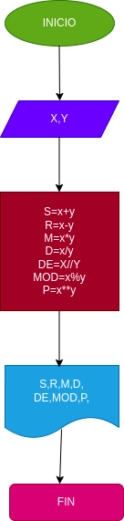

# Operecion-Aritm-tica
programa para calcular la suma, resta, multiplicacion, division, division entera, modulo y potencia de 2 unidades

## Calcular mediantes 2 numeros enteros distintas operaciones.

# Analisis

-Variable de entera 

X y Y: es igual a dos numeros naturales, para desarrollar las operaciones aritmeticas correspondientes 

-Variable de salida 

s: x+y
r: x-y
m: x*y
d:x/y
de: x//y
mod: x%y
p: x**y

# Diseño

# Construccion